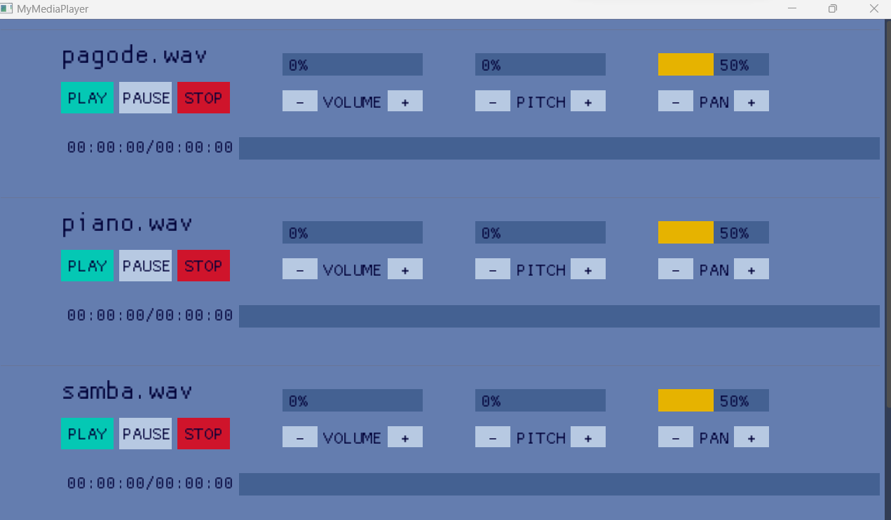
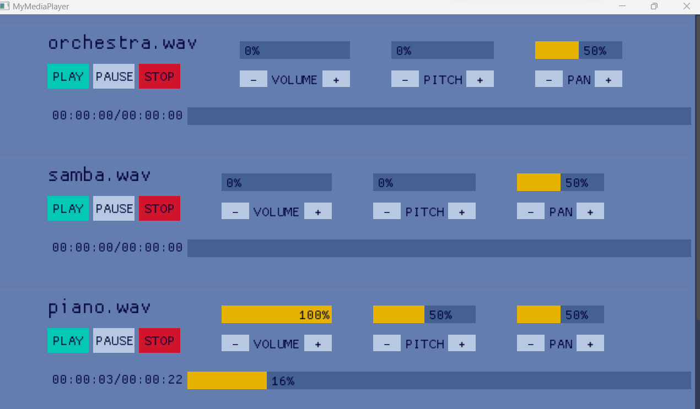

# Project 1 - Audio system

## About

Project 1 for "Media fundamental" class. An audio system to manage audio files and channels using FMOD and C++.

## Requirements

- Visual studio 2022
- FMOD

## How to run

1. Extract all libs that are zipped in the "Extern/lib" folder
2. Open the solution file in Visual Studio 2022.
3. Click in the "play" icon
3.1. To build and use the executables they must be in the same folder as the "Assets" and the "src" folder, inside "Project1_AudioSystem\Project1_MediaPlayer"

## How to use

- All the audio files will be loaded from the "Assets\\Audio" folder.
- To change which audios you want to load you can modify the "audioDB.txt". *IMPORTANT: The path can't have spaces for now!*
- The "audioDB.txt" structure is:
  - First col: How the audio will be loaded (1 - Sample, all loaded into memory. 2 - Stream, not loaded all into memory but consumes more processing)
  - Second col: The path to the audio (Can't have spaces on the path)
- When you open the program you'll have a list of audios to play and you can scroll down to see all the available audios.
- You can hit "PLAY" to start the audio and the playback position will be shown in the bar.
- You can adjust the volume, pitch and pan accordingly using the "-" and "+" buttons.
- To stop the audio from playing just click on "STOP".

### Screenshots

